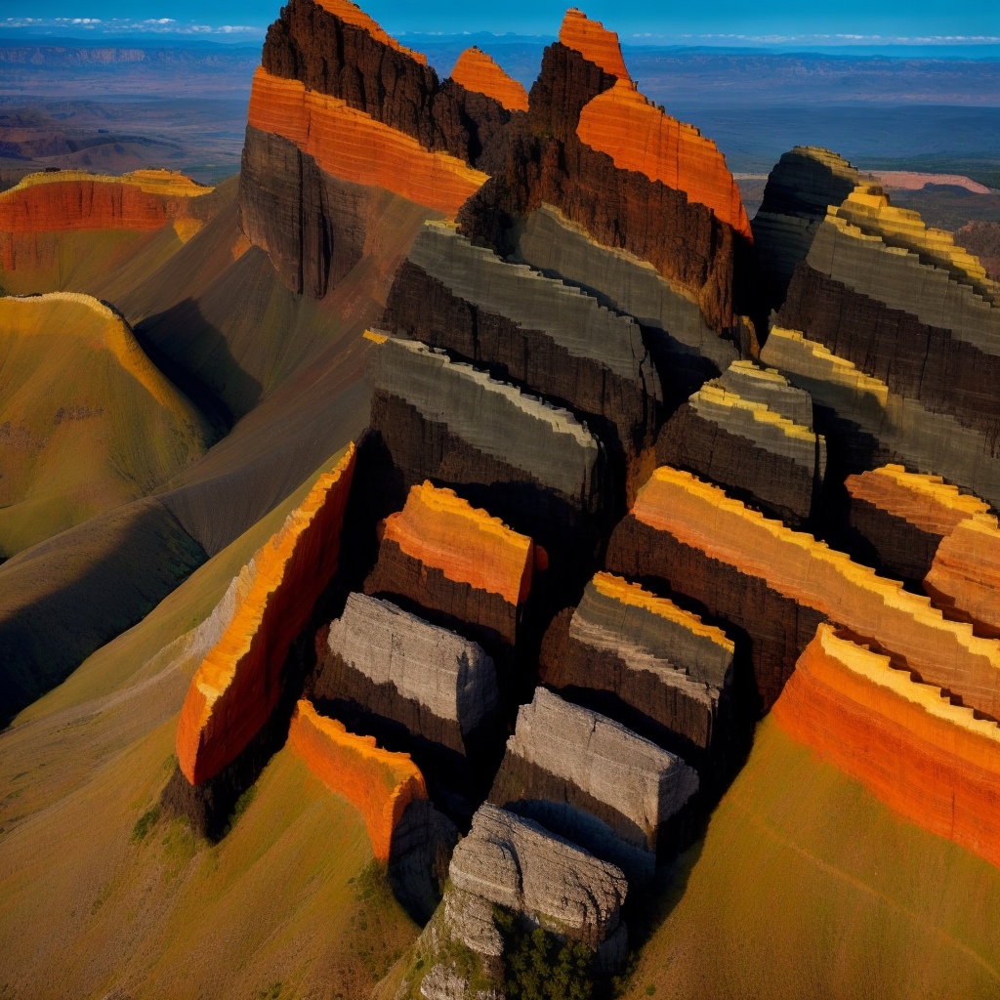
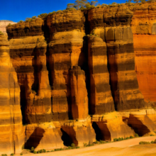
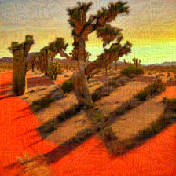
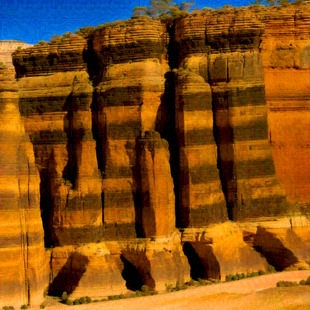

# CaptchaShield — Adversarial Perturbation Benchmark for VLM-based CAPTCHA

This repository contains the **attack pipeline** and **VLM evaluation code** for the CaptchaShield benchmark. We systematically evaluate six adversarial perturbation methods as defenses against three commercial Vision-Language Models (VLMs) on Chinese character CAPTCHA images generated by the Illusion Diffusion pipeline.

**Key results** (1,000 images · 6 attack methods · 3 VLMs · 54,000 API calls):

| Metric | Range across 6 methods |
|--------|----------------------|
| Attack Success Rate (ASR↑) | **97.9 – 99.5%** |
| Perceptual distortion (LPIPS↑) | **0.400 – 0.775** |
| Time per image | **2.5 s (MMCoA) – 94 s (Nightshade)** |
| Cross-VLM std (CA) | **0.55 – 1.57%** |

---

## Repository Structure

```
posion_attack/
├── run_all_attacks.sh          # Orchestration: runs all 6 attacks in sequence
├── ATTACK_PARAMS.md            # Detailed per-method hyperparameter documentation
├── install_all_envs.sh         # One-shot conda environment setup for all methods
│
├── AdversarialAttacks/         # Glaze  — MI-FGSM / CWA transfer attack
├── Anti-DreamBooth/            # ASPL   — latent-space fine-tuning disruption
├── MMCoA/                      # MMCoA  — multimodal CLIP joint attack
├── nightshade-release/         # Nightshade — concept-level data poisoning
├── XTransferBench/             # XTransfer — ensemble super-transfer attack
├── Attack-Bard/                # AMP    — surrogate VLM transfer attack
│
├── AttackVLM/                  # VLM evaluator  (test_captcha_v2.py)
│
└── demo/
    ├── source/                 # 3 original CAPTCHA images
    └── attacked/
        ├── mmcoa/              # MMCoA adversarial examples
        ├── amp/                # AMP adversarial examples
        ├── aspl/               # ASPL adversarial examples
        ├── xtransfer/          # XTransfer adversarial examples
        ├── nightshade/         # Nightshade adversarial examples
        └── glaze/              # Glaze adversarial examples
```

---

## Demo

### How CAPTCHA images are generated

Each image is produced by the **Illusion Diffusion** pipeline: a Chinese character's stroke skeleton is used as a ControlNet conditioning map, and Stable Diffusion 2.1 renders a photorealistic landscape around it. The character shape is naturally embedded in the scene — visible to a careful human reader but seamlessly blended with the background.

### Source images (no perturbation)

| `captcha_1_zhan.png` | `captcha_2_pu.png` | `captcha_3_bi.png` |
|:---:|:---:|:---:|
|  |  |  |
| **蘸** (zhàn) · canyon escarpment | **蒲** (pú) · aerial rock formation | **笔** (bǐ) · desert Joshua-tree sunset |

> All three CAPTCHAs are **correctly recognized** by GPT-5.2, Gemini 3.0, and GLM-4V at baseline (avg CA ≈ 90.8%).

---

### Adversarial perturbations — visual comparison

The same source image `captcha_1_zhan.png` (character **蘸**) after each of the six attacks.
All perturbations are **bounded in L∞ norm** (or CLIP embedding norm for MMCoA); after attack, all three VLMs fail to recognize the character (ASR ≈ 99%).

#### MMCoA · ε = 1/255 in CLIP space · 100 steps
> Operates entirely in the **CLIP multimodal embedding space**. The pixel change is so small (1/255) that the image is nearly indistinguishable from the source — yet the joint image–text embedding is shifted far enough to destroy VLM recognition. **Fastest method (2.5 s/img) and lowest perceptual distortion (LPIPS 0.400).**

| captcha\_1 | captcha\_2 | captcha\_3 |
|:---:|:---:|:---:|
|  |  |  |

---

#### AMP (AttackVLM) · ε = 8/255 · 300 steps
> Crafts adversarial examples against an **ensemble of open-source VLM surrogates** (BLIP, BLIP-2) via PGD, then transfers to closed-source commercial VLMs. Perturbation manifests as subtle watery/painterly smearing on edges — noticeable on close inspection but the scene remains clear. **LPIPS 0.431, ASR 99.4%.**

| captcha\_1 | captcha\_2 | captcha\_3 |
|:---:|:---:|:---:|
|  |  |  |

---

#### ASPL (Anti-DreamBooth) · ε = 0.05 in [-1, 1] space · 200 steps
> Maximizes feature deviation in **Stable Diffusion's latent encoder space** via Surrogate Prompt Learning, disrupting fine-tuning pipelines. Produces fine-grained high-frequency noise spread evenly across the image; overall tone and composition preserved but texture is slightly grainy. **LPIPS 0.558, ASR 99.4%.**

| captcha\_1 | captcha\_2 | captcha\_3 |
|:---:|:---:|:---:|
|  |  |  |

---

#### XTransfer · ε = 12/255 · 300 steps
> Improves black-box transferability by **summing** (rather than averaging) surrogate model logits in an ensemble of 4 CLIP models. Introduces pronounced sketch-like edge outlines and crosshatch texture across the image — visually similar to Glaze but with slightly stronger structural fidelity. **LPIPS 0.512, ASR 99.1%.**

| captcha\_1 | captcha\_2 | captcha\_3 |
|:---:|:---:|:---:|
|  |  |  |

---

#### Nightshade · ε = 0.05 in [0, 1] space · 500 steps
> Shifts **CLIP text–image embeddings** toward a semantically unrelated target concept, poisoning the downstream concept-to-image association. Perturbation appears as heavy impasto oil-paint strokes and diffuse color blotches — the most visually distinctive distortion in the benchmark. **Slowest method (94 s/img), LPIPS 0.623, ASR 99.0%.**

| captcha\_1 | captcha\_2 | captcha\_3 |
|:---:|:---:|:---:|
|  |  |  |

---

#### Glaze · ε = 16/255 · 300 steps
> Shifts the image's **style-encoder representation** toward a dissimilar target style using MI-FGSM. Produces the most obvious visual artifact: the image acquires a strong oil-painting / impressionist brushstroke texture, with pigment smearing visible across rock surfaces. **Highest LPIPS (0.775) — most visible distortion — yet still ASR 97.9%.**

| captcha\_1 | captcha\_2 | captcha\_3 |
|:---:|:---:|:---:|
|  |  |  |

---

### Visual distortion vs. attack effectiveness

Sorted by perceptual distortion (LPIPS, lower = cleaner):

| Method | LPIPS↓ | ASR↑ | Time/img | Visible artifact |
|--------|--------|------|----------|-----------------|
| **MMCoA** | **0.400** | **99.5%** | 2.5 s | Nearly invisible — sub-pixel shift in CLIP space |
| AMP | 0.431 | 99.4% | 30 s | Faint painterly smear on edges |
| XTransfer | 0.512 | 99.1% | 20 s | Sketch-like edge outlines and crosshatch |
| ASPL | 0.558 | 99.4% | 25 s | Fine-grained uniform noise, slightly grainy |
| Nightshade | 0.623 | 99.0% | 94 s | Heavy impasto brushstrokes, color diffusion |
| Glaze | 0.775 | 97.9% | 15 s | Strong oil-painting texture, most obvious |

**Key takeaway**: MMCoA achieves the best trade-off — highest ASR, lowest distortion, and 37× faster than Nightshade. Glaze produces the heaviest visual artifact while having the lowest ASR.

---

## Benchmarked Methods

| Method | Paper | Venue | Perturbation Space | ε | Steps | Surrogate |
|--------|-------|-------|--------------------|---|-------|-----------|
| ASPL | [Anti-DreamBooth](https://arxiv.org/abs/2303.15433) | ICCV 2023 | [-1,1] L∞ | 0.05 | 200 | SD 2.1 |
| Glaze | [Rethinking Ensemble](https://arxiv.org/abs/2303.09105) | ICLR 2024 | [0,255] L∞ | 16/255 | 300 | ViT-L/14 (CLIP) |
| AMP | [AttackVLM](https://arxiv.org/abs/2305.16934) | NeurIPS 2023 | [0,255] L∞ | 8/255 | 300 | BLIP / BLIP-2 |
| XTransfer | [XTransferBench](https://arxiv.org/abs/2505.05528) | ICML 2025 | [0,255] L∞ | 12/255 | 300 | Ensemble ×4 |
| Nightshade | [Nightshade](https://arxiv.org/abs/2310.13828) | IEEE S&P 2024 | [0,1] L∞ | 0.05 | 500 | SD 2.1 |
| MMCoA | [MMCoA](https://arxiv.org/abs/2404.19287) | arXiv 2024 | CLIP embedding | 1/255 | 100 | ViT-B/32 (CLIP) |

All methods use **author-recommended hyperparameters**. See [`ATTACK_PARAMS.md`](ATTACK_PARAMS.md) for full parameter documentation including parameter-space conversion formulas.

---

## Dataset

Generated via the **Illusion Diffusion** pipeline (ControlNet + SD 2.1):

| Component | Count |
|-----------|-------|
| Chinese characters (GB2312 Level-1) | 3,500 |
| Background images | 120 |
| Base images total | 420,000 |
| Evaluation subset (stratified) | 1,000 |
| Attacked images (×6 methods) | 6,000 |
| VLM API calls (Q1+Q2+Q3 × 3 VLMs) | 54,000 |

---

## Evaluation Protocol

Each attacked image is probed with **three complementary questions**:

| Q | Metric | Prompt | What it measures |
|---|--------|--------|-----------------|
| Q1 | CA↓ / ASR↑ | *"Please identify the Chinese character shown in this image."* | Direct recognition accuracy |
| Q2 | TVR↓ | *"Is there a clearly readable Chinese character in this image? Answer yes or no."* | Whether perturbation conceals the text |
| Q3 | CR↑ | *"If this image contains a Chinese character, what is it most likely? Respond with one character or 'none'."* | Whether the VLM is actively misled toward the target character |

### Target VLMs

| VLM | Deployment | API version |
|-----|-----------|-------------|
| GPT-5.2 | `gpt-5.2-ruisun` (Azure OpenAI) | `2024-12-01-preview` |
| Gemini 3.0 | `gemini-3-flash-preview` (Google GenAI) | v1beta |
| GLM-4V | `glm-4v-flash` (Zhipu AI) | v4 OpenAI-compat. |

All calls: `max_tokens=64`, default temperature, 10 s timeout.

---

## Installation

### Requirements
- NVIDIA GPU (RTX 3090 24 GB recommended; each method needs 4–20 GB VRAM)
- CUDA 11.8+, Anaconda / Miniconda

### Setup all conda environments
```bash
cd posion_attack
bash install_all_envs.sh
```

| Conda env | Method |
|-----------|--------|
| `adv_attack` | Glaze |
| `anti_dreambooth` | ASPL |
| `mmcoa` | MMCoA |
| `nightshade` | Nightshade |
| `xtransfer` | XTransfer |
| `attack_bard` | AMP |
| `attackvlm` | VLM Evaluator |

### API keys (for VLM evaluation)
```bash
export AZURE_OPENAI_API_KEY="..."
export AZURE_OPENAI_ENDPOINT="https://<resource>.openai.azure.com/"
export GOOGLE_API_KEY="..."
export ZHIPU_API_KEY="..."
```

---

## Usage

### Step 1 — Run all attacks

```bash
cd posion_attack

# Paper-default hyperparameters (recommended for fair comparison)
bash run_all_attacks.sh \
    --source_dir /path/to/source_images \
    --target_dir /path/to/target_images \
    --match_json /path/to/match.json

# Quick sanity check: 3 images per method
bash run_all_attacks.sh \
    --source_dir /path/to/source \
    --target_dir /path/to/target \
    --match_json /path/to/match.json \
    --mini

# Unified budget for cross-method comparison
bash run_all_attacks.sh \
    --source_dir /path/to/source \
    --target_dir /path/to/target \
    --epsilon 16 --steps 300

# Skip slow SD-based methods (no local SD model required)
bash run_all_attacks.sh \
    --source_dir /path/to/source \
    --target_dir /path/to/target \
    --skip_nightshade --skip_aspl
```

Output:
```
outputs/run_full_YYYYMMDD_HHMMSS/
├── images/
│   ├── mmcoa_eps1_steps100/
│   ├── aspl_eps0.05_steps200/
│   ├── mi_eps16_steps300/          ← Glaze
│   ├── attackvlm_eps8_steps300/    ← AMP
│   ├── xtransfer_eps12_steps300/
│   └── nightshade_eps0.05_steps500/
└── log/
    ├── AttackMMCoA_eps1_steps100.log
    ├── AttackMMCoA_eps1_steps100_resource_log.txt
    └── all_resource_summary.txt    ← combined GPU/time report
```

### Step 2 — Run individual methods

```bash
# MMCoA (fastest, best quality)
conda activate mmcoa && cd MMCoA
python AttackMMCoA.py \
    --source_dir /path/to/source --target_dir /path/to/target \
    --output_dir ./out_mmcoa --epsilon 1 --num_iters 100

# Glaze / MI-FGSM
conda activate adv_attack && cd AdversarialAttacks
python AttackMI.py \
    --source_dir /path/to/source --target_dir /path/to/target \
    --output_dir ./out_glaze --epsilon 16 --steps 300

# ASPL (requires Stable Diffusion 2.1 locally)
conda activate anti_dreambooth && cd Anti-DreamBooth
python AttackASPL.py \
    --source_dir /path/to/source --target_dir /path/to/target \
    --output_dir ./out_aspl --sd_model /path/to/sd-2-1 \
    --pgd_eps 0.05 --pgd_steps 200 --pgd_alpha 0.005

# AMP — reads target character from per-image .json files
conda activate attack_bard && cd Attack-Bard
python AttackBard.py \
    --source_dir /path/to/source --output_dir ./out_amp \
    --epsilon 8 --steps 300 --use_json_text
```

### Step 3 — VLM evaluation

```bash
conda activate attackvlm
cd AttackVLM

python test_captcha_v2.py --mini_test          # 3 samples, all VLMs
python test_captcha_v2.py --num_images 50      # 50 samples
python test_captcha_v2.py --mini_test --skip_gpt   # skip GPT cost
python test_captcha_v2.py                      # full run (1,000 samples)
```

Results saved to `eval_results_v2/run_YYYYMMDD_HHMMSS/`:
- Per-image JSON with Q1/Q2/Q3 responses from all three VLMs
- `final_summary_*.json` — aggregated CA, ASR, CR, TVR per method × VLM

---

## Hyperparameter Reference

| Method | Norm space | ε (paper default) | Steps | GPU mem | Time/img |
|--------|-----------|-------------------|-------|---------|---------|
| MMCoA | CLIP embedding | 1/255 | 100 | ~4 GB | ~2.5 s |
| Glaze | [-1,1] L∞ | 16/255 | 300 | ~8 GB | ~15 s |
| AMP | [0,255] L∞ | 8/255 | 300 | ~16 GB | ~30 s |
| XTransfer | [0,255] L∞ | 12/255 | 300 | ~8 GB | ~20 s |
| ASPL | [-1,1] L∞ | 0.05 (≈12.75/255) | 200 | ~12 GB | ~25 s |
| Nightshade | [0,1] L∞ | 0.05 (≈12.75/255) | 500 | ~20 GB | ~94 s |

> **Why does MMCoA use ε = 1/255?**
> MMCoA attacks the CLIP joint embedding space, not raw pixel space. In CLIP's visual–semantic representation, 1/255 pixels of perturbation produces substantial semantic drift; larger ε degrades image quality without proportional gain in ASR.

Pass `--epsilon 16 --steps 300` to `run_all_attacks.sh` for a unified cross-method comparison at the same perturbation budget.
